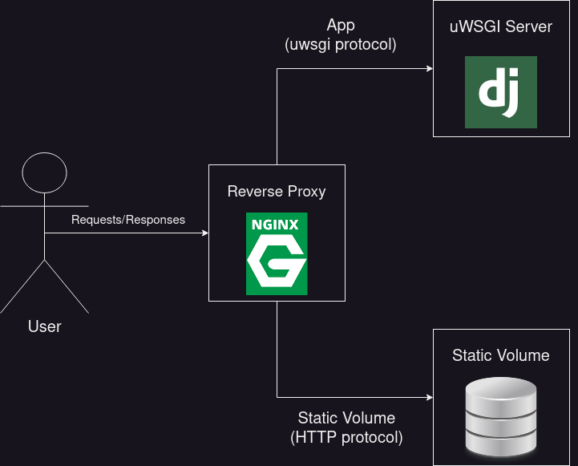

# Video game web app

This project revolves around the development of a backend web application that allows an authenticated user to create a video game object and store it in a postgres database. This is accomplished via Django and incorporating the REST framework.

## Features and Functionality
One key feature of this application is the ability to create and authenticate users via an email and password.

Once authenticated, a user can:
* Create a video game
* Create and assign tags
* Create and assign consoles
* Upload images for a video game
* Search and filter video games based on tags and consoles

## Deployment (local)
The local deployment process is outlined in the [`docker-compose.yml`](docker-compose.yml) file. The key elements to be aware of are the containers and the volumes used in the setup.

### Containers

#### app container (depends on db container)
* Built using the Dockerfile defined in the current directory
* The container's port `8000` is mapped to the host port `8000`
* Volumes are mounted
    * `./app` to `/app`
    * `dev-static-data` to `/vol/web`
* A series of commands are executed
    * Wait for the database to be available
    * Perform migrations
    * Runs the Django server on `0.0.0.0:8000`
* Environment variables set for the database connection details

#### db container
* Uses the `postgres:13-alpine` image
* Volume `dev-db-data` is mounted to `/var/lib/postgresql/data` within the container
* Environment variables are set for the database name, username, and password

### Volumes
* `dev-db-data`: Contains the PostgreSQL database
* `dev-static-data`: Contains static files (currently stores user provided images for a video game)

## Deployment (Cloud)
The cloud deployment process is outlined in the [`docker-compose-deploy.yml`](docker-compose-deploy.yml) file. The key changes to be aware of are the changes to the `app` container which is now executed via a uWSGI server, and a newly added `proxy` container. Below is a visual representation of the containers, how they communicate, and their functionality

### proxy (Nginx)
* Configured as a `reverse proxy`.
* Act as an intermediary to communicate with the uWSGI server
* Handle the serving of static files

### app (uWsgi and Django)
* Receives requests from Nginx 
* Executes Django code

To see a complete list of changes to the code base, see commits in range `a96c313`,`8b22f9f` 